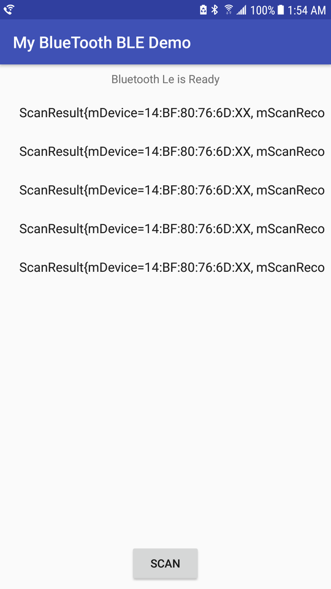

# Scan-Bluetooth-le
## Main Features
Scans for BLE-enabled peripherals using Android Bluetooth_LE GATT API

## Significance
Contains code demonstrating Android GATT API by performing READ, WRITE, and NOTIFY by operating on the GATT Characteristic and descriptors, in order to expose Bluetooth LE Devices to ANDROID

## Resources
[How To Use Android BLE to Communicate with Bluetooth Devices - An Overview & Code examples](https://medium.com/@avigezerit/bluetooth-low-energy-on-android-22bc7310387a)

[Bluetooth low energy overview](https://developer.android.com/guide/topics/connectivity/bluetooth-le#notification)

[GATT Specifications](https://www.bluetooth.com/specifications/gatt)
